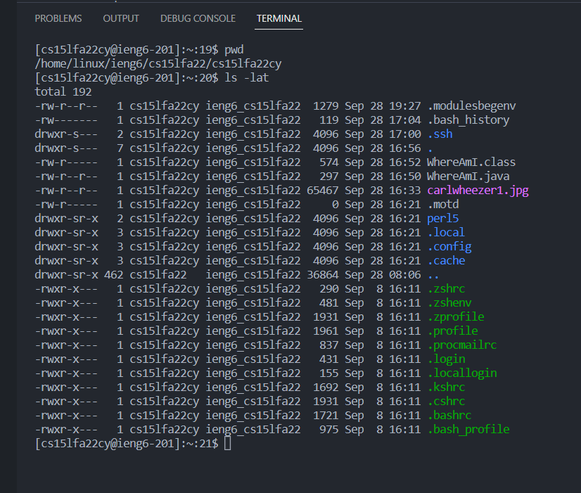

## Week 1 - September 28, 2022

### Lab Objectives:
- Using VSCode
- Using OpenSSH
- Using Basic Linux Commands
- Using SCP
- RSA Key Protocol

### Who I worked with:
- Kyle Trinh (this is me)
- Austin
- Matthew
- James
- Andy
- Yates

### Step 1: Installing Visual Studio Code

The first thing you need to do is essentially [install Visual Studio Code](https://code.visualstudio.com/), or VSC, VS Code. This is a text editor used for writing in any language. In our case, we will be using **Markdown** and **Java** to write, compile, and transfer code remotely accross a file system. 


Above is what you should see when you download VSC. It should look a little different as I already have a folder opened in the left hand tab. Yours may be empty. Again, the link to download is [here](https://code.visualstudio.com/).

### Step 2: CSE 15L Account, OpenSSH

Before signing into your account onto the UCSD servers (or whatever server you're trying to log into) you must first know your username.

Below is the link to check ALL your ucsd accounts tied to the ETS server system. 

https://sdacs.ucsd.edu/~icc/index.php 

Here, you want to find your "cs15lfa22++" account. Replace the "+" with the two letters within your own username. To clarify, the "15l" is not $151$, but rather $15l$, the letter L but lowercase. 

Before you can login to this account, look to [reset](https://sdacs.ucsd.edu/~icc/index.php) the password as this will be your first time connected to a remote server with this account. Follow the instructions carefully as it may take from 15 minutes to 24 hours for your password to update on your account.

Next, you will want to download the program that allows you to remotely connect to the UCSD server, using [OpenSSH](https://learn.microsoft.com/en-us/windows-server/administration/openssh/openssh_install_firstuse?tabs=gui). As a user, once you download the appropiate OpenSSH version on your operating system (Windows, MacOS, Linux, etc.), you run this program on your computer's Terminal.

Next, connect to your OpenSSH account once you have completed the prior steps using:
```
$ ssh cs15lfa22cy@ieng6.ucsd.edu
```
In this command, input your CSE 15L account to the left of the "@", replacing the last two letters with your account. To the right, that is the server you are connecting to. In this case, I am connecting to ieng6 server at UCSD.

On your first time using this command, you may see:
```
$ ssh cs15lfa22zz@ieng6.ucsd.edu
The authenticity of host 'ieng6.ucsd.edu (128.54.70.227)' can't be established.
RSA key fingerprint is SHA256:ksruYwhnYH+sySHnHAtLUHngrPEyZTDl/1x99wUQcec.
Are you sure you want to continue connecting (yes/no/[fingerprint])? 
```
Here, just type "yes" and press enter to continue. You will see something resembling the following:

Notice the change in the command line user and working directory.

### Step 3: Trying Some Commands
Here are a couple commands you can try out in the remote server:
```
ls   : list subdirectories
cd   : change directories
pwd  : print working directory
man  : manual of a specific command
cat  : "concatenate" a specific file (i.e. print it)
exit : logs out the server
-------------------------
Try:
ls
cd ..
cd /
cd Examples
man cd
man ls
cat HelloWorld.java
ls -lat
exit
```

An Example of my own Terminal: 


### Step 4: Moving Files with scp
Now that you can connect, you will learn how to use the command, ```scp``` which essentially allows you to remotely move a file from your current system to the remote SSH server. Firstly, in VSC, create a file called ```WhereAmI.java```. This file should have the following code:
```java
class WhereAmI {
    public static void main(String[] args) {
    System.out.println(System.getProperty("os.name"));
    System.out.println(System.getProperty("user.name"));
    System.out.println(System.getProperty("user.home"));
    System.out.println(System.getProperty("user.dir"));
  }
}
```
Next, in the Terminal, run the following commands (in order). Ensure the file names are spelled correctly.

```
$ javac WhereAmI.java
$ java WhereAmI
```


This essnetially compiled the file and then runs the class file that is generated. Note that these commands must be run in the same directory as the file inside. Now, repeat the same in  the client server to note the differences.


### Step 5: Setting an SSH Key
This one is pretty sequential:
- On your client, run ```ssh-keygen```. This will generate a prompt for a password

- Enter your password to generate a key
- log onto the client
- use: ```mkdir .ssh``` on the server and then ```logout```.
- use scp as seen above to move the keygen onto the remote server onto the correct directory
- Hint: using ```~``` makes it easier as it uses your home directory.

### Step 6: Optimizing Remote Running
Lastly, now focus on how you can optimize running your program.
- Using the up key on your keyboard to return to a previously used command is extremely helpful.
- having the password on a clipboard 
- use `cp` to run multiple commands at the same time with semi-colons
- use `"ls"` after a `ssh` such as:
```
$ ssh cs15lfa22@ieng6.ucsd.edu "ls"
```
- memorize as many basic commands as you can see, like the ones above!
 

Example seen above. It runs ls as soon as it connects to the SSH server