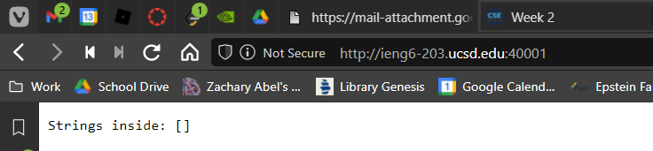
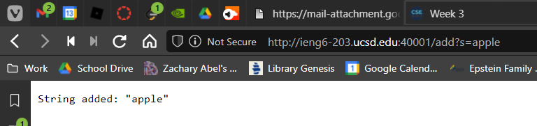
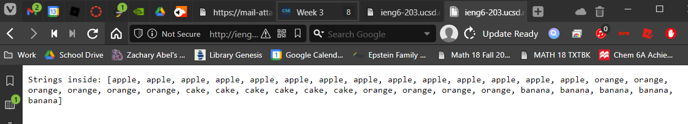
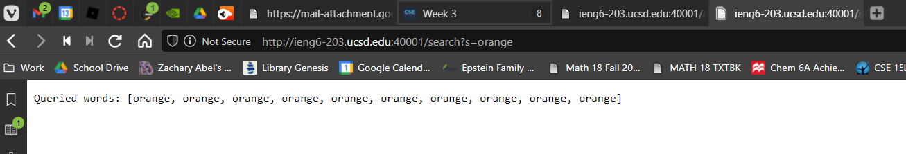
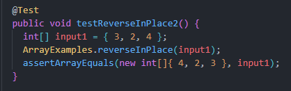
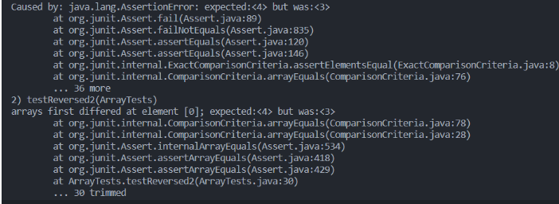
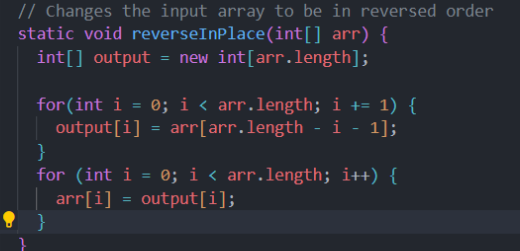
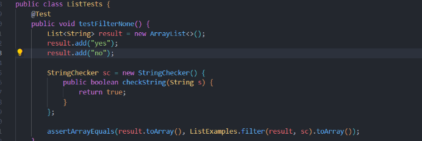
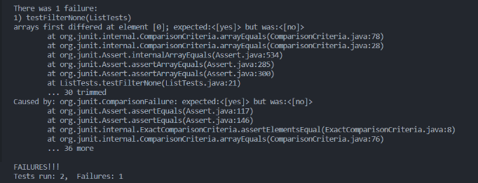
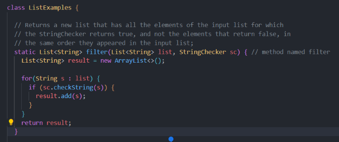

## Part 1
```Java
import java.io.IOException;
import java.net.URI;
import java.util.ArrayList;

class Handler implements URLHandler {
    // The one bit of state on the server: a numbear that will be manipulated by
    // various requests.
    ArrayList<String> stringStore = new ArrayList<>();

    public String handleRequest(URI url) {
        if (url.getPath().equals("/")) {

            return String.format(
                
            "Strings inside: " + stringStore.toString()
            
            );

        } else {
            System.out.println("Path: " + url.getPath());
            if (url.getPath().contains("/add")) {
                String[] parameters = url.getQuery().split("="); // parse to take arguments after the Query symbol "?" /add?s=apple

                if (parameters[0].equals("s")) {
                    stringStore.add(parameters[1]);
                    return String.format("String added: " + "\"" + parameters[1] + "\""); // String added: "string"
                }
            }

            if (url.getPath().contains("/search")) {
                String[] parameters = url.getQuery().split("="); // parse to take arguments after the Query symbol "?" /add?s=apple
                ArrayList<String> queried = new ArrayList<>();
                
                for (String s : stringStore) { // iterate parameters given queries
                    if (s.contains(parameters[1])) { // check for given query
                        queried.add(s); // add matching query
                    }
                }
                return String.format("Queried words: " + queried.toString()); // display AL w/ all words that contain it.
            }
            return "404 Not Found!";
        }
    }
}

class SearchEngine {
    public static void main(String[] args) throws IOException {
        if(args.length == 0){
            System.out.println("Missing port number! Try any number between 1024 to 49151");
            return;
        }

        int port = Integer.parseInt(args[0]);

        Server.start(port, new Handler());
    }
}
```



The handleRequest method is called to display the web server page. It calls on the Sever file to also run: URLHandler, and ServerHttpHandler. These allow browsers to connect to the server running the web page and access its contents. 

There are no values inputed yet, so the string array has no strings inside of it to work. However, the port number allows the browser to connect to a specific port of the ieng6-203 server.

If the port number changed, the browser would not be able to connect to the web page (unless if someone was using the port for something else). It would only work with my webpage if the port number was the one I started the server with. 



In this method, the handleRequest method is called again when the /add page is accessed. This means that it added an apple to an arrayList of Strings storing the added strings. If the page is refreshed, the handleRequest method is called again and will keep adding more "apple" to the stringStore as it is repeatedly called.

The value added is "apple". It is a string get used an ArrayList method to append it to the stringStore. When the main index page is accessed again, it will show how the string has been added to it.

If the String changed from to say, "orange" it would add orange instead of apple to the stringStore ArrayList. On the index page it would display a different set of strings. Since it adds at the end of the ArrayList, the time of the request is very low. 



See above for example.



In this screenshot, the handleRequest method is called again but instead, it calls the query method within it. It then loops through the stringStore arrayList finding the strings that match with the query.

The value, "orange" tells the query operator to find all words containing the characters "orange" in order. If it was shortened to "e", it would output all words in the stringStore with the string "e" inside of it, omitting word without an "e".

If this value were to change, it would then find all strings that contain the given string inside of it. However, it would not change the time of request unless the stringStore has many, many, many items.

## Part 2

### Array Methods

#### reverseInPlace(): 



Test that broke the code.



Failing Test Output.



The code fix that was needed.

ReverseInPlace lost the value whenever it switched, so the index value was lost, and thus it did not reverse correctly. This would then cause a symptom that the test caught and showed in the terminal.

### List Methods

#### filter(List<String> list, StringChecker sc)



This was the test that broke the code for the filter method. It was not filtering properly.



The failing output in the terminal by JUnit.



The code that fixed the bug.

For this particular unit, the bug was caused by the the fact the the result.add method was adding the checked result to the front of the array. However, the instructions required the output to be in order as found in the list. Thus, by removing the "0," and using the overloaded .add ArrayList method, the bug was fixed. 