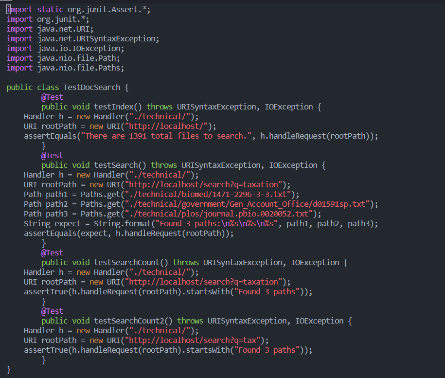
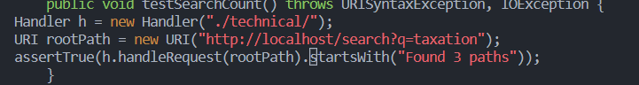
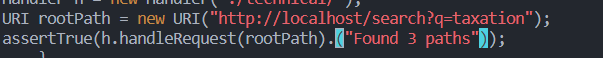
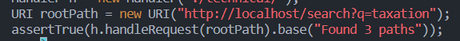
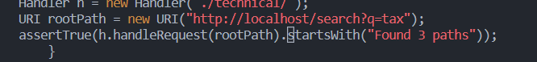
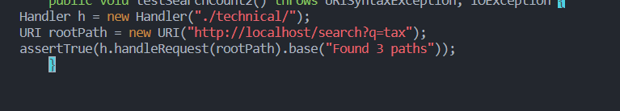
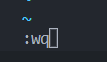

# Week 7 Report
[Return to Main Page](https://kyle-trinh-ucsd.github.io/cse15l-lab-reports/)
## Part 1
My group chose to do the first task: 
```
Changing the name of the start parameter and its uses to base
```
We managed to get this sequence of Vim commands that we thought was pretty short:

1. vim `<Shift>` D `<tab>`



2. /start, enter, dw, i, base, esc







3. n, dw, i, base, esc





4. n, dw, i, base, esc



5. :wq `<Enter>`


We found that using `/start` and `n` was useful to traverse multiple times. We were unable to get the`.` key to work, although we may have a large misunderstanding of its scope. We also used `dw` quite a few times; it is very useful for deleting quick text. The undo key `u` helped with testing this also.

## Part 2

In the first part, it took me 5 minutes to complete the task of starting in VS Code and using `scp` to bring the code to the remote server. I had to wait a significant amount of time before I was able to connect to the remote server. Also, having to retype the `ssh` command every time I wanted to connect was fairly time consuming (I could've kept it on my clipboard but that would lock out copying and pasting in general). 

In the second part, it took me 4.50 minutes to edit the task in Vim and run it with `bash test.sh`. I had some difficulties like remembering what Vim commands there were that I could use. I feel that I could have been more efficient, but the task was finished and the change was fairly minor anyway.

If I were had to choose, I would rather use Vim if I had a program that required to be run remotely. This is a lot easier because I can just edit it in situ whereas VS Code would require me to edit it and upload it the server. Also, my workplace may not allow me to upload files to the server, so knowing how to use Vim is much easier. 

I think that if the project was larger and maybe required multiple hours, I would probably code it on VS Code then `scp -r` the entire directory to the remote server. VS Code provides so many resources that allows me to debug and run my file on the remote server. It also allows me to see multiple files and an entire graphical representation of my file system without having multiple terminals or pressing `cd` and `ls` every time I want to switch directories or see where I am. Additionally, I do not need a consistent internet connection to use VS Code, which is something that is not guanranteed as UCSD. 

*November 10, 2022*